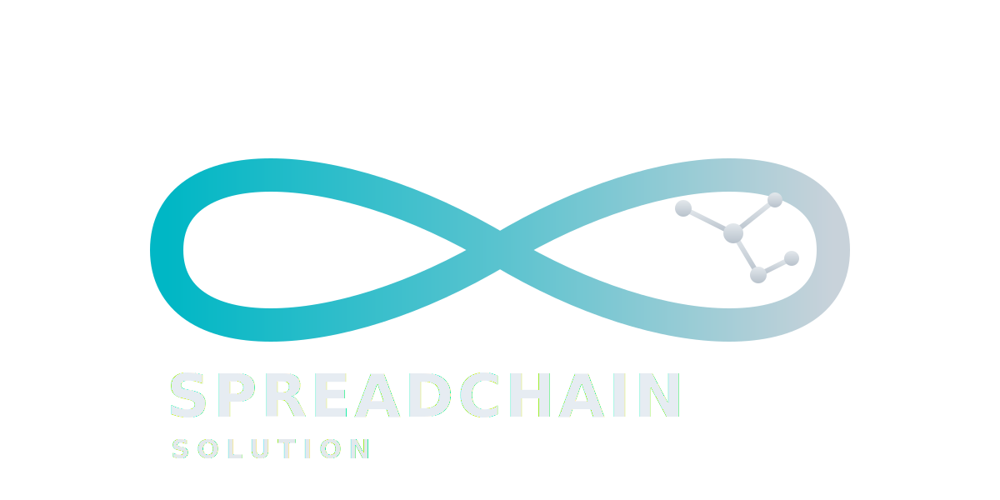
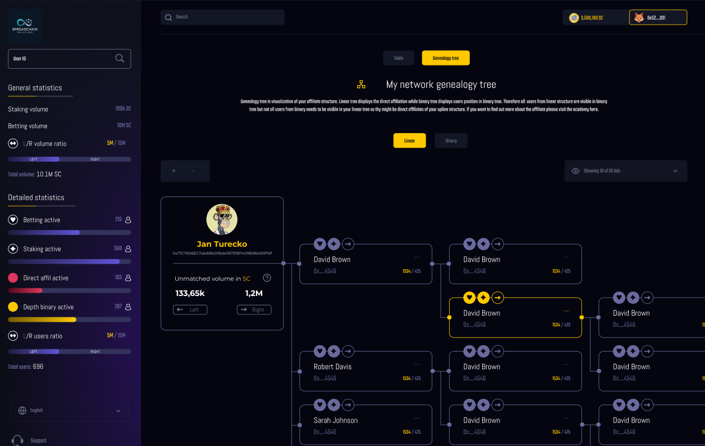
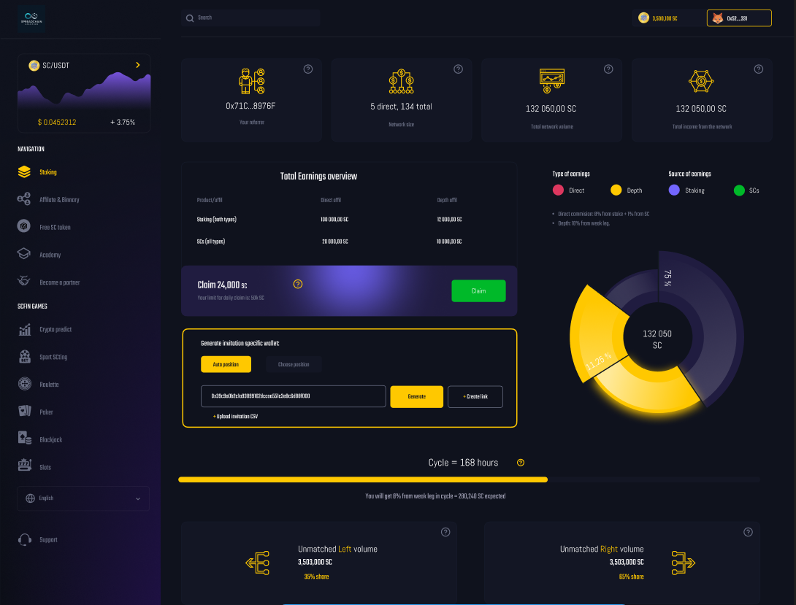
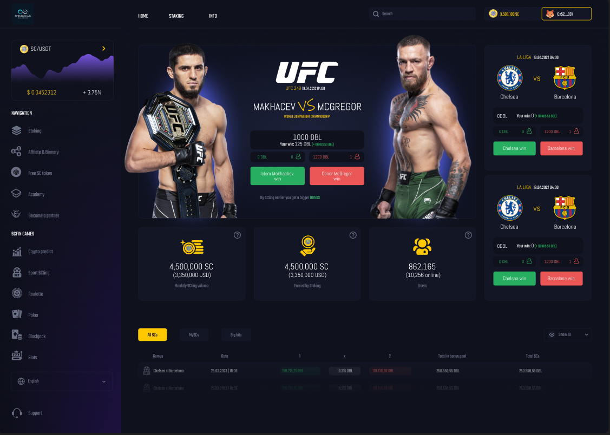
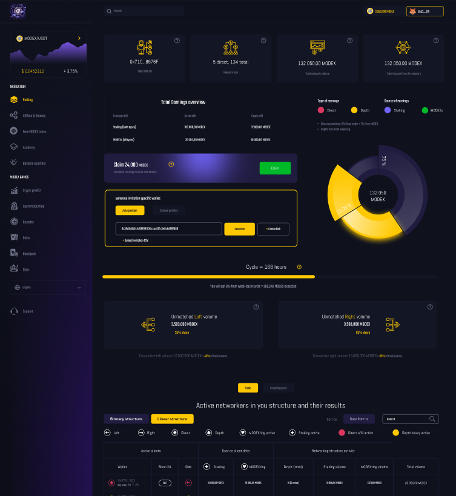

# SpreadChain – Web3 Gaming & Staking Platform (Demo Version)

 

## Project Overview
SpreadChain is a **multi-utility Web3 platform** that unites staking, gaming, sports betting, and education into a single blockchain-powered ecosystem.

### Core Features
- **Staking:** Lock SC tokens (and other supported assets) to earn rewards and fuel the gaming economy.
- **Gaming:** Enjoy casino-style games such as roulette, slots, and prize wheels for fast-paced entertainment.
- **Sports Betting:** Bet on live and upcoming events with competitive odds and multiple market types.
- **Academy:** Learn crypto basics, platform mechanics, and risk management through interactive modules.

Our mission is to create an **all-in-one hub** where users can **play, earn, and learn**—without needing multiple platforms.

---

## Demo Version
The demo showcases:
- **Basic Staking Dashboard** – Simulated staking and reward calculation.
- **Mini Games Preview** – Early versions of roulette, slots, and spin-the-wheel.
- **Sports Betting Interface** – UI mock-up with live odds integration.
- **Educational Hub** – Sample lessons and gamified learning quizzes.

> **Note:** The demo uses **testnet** smart contracts and mock data for demonstration purposes. It is **not** connected to mainnet or real funds.

---

## Screenshots & UI Preview

### Staking Dashboard

*Users can lock tokens and track rewards in real-time.*

### Game Lobby

*Preview of roulette, slots, and spin-the-wheel games.*

### Sports Betting UI

*Place bets on live and upcoming events.*

### Academy Module

*Interactive learning section with crypto fundamentals.*

---

## Installation & Running the Project

### 1. Clone the Repository
```bash
git clone https://github.com/SpreadChain-Solutions/SpreadChain-Gaming-MVP-v2
cd SpreadChain-Gaming-MVP-v2
```

### 2. Install Dependencies
```bash
npm install
```
### 3. Run the Development Server
```bash
npm start
```
## The application will start on:
```bash
http://localhost:3000
```
## Tech Stack
- **Frontend**: React / Next.js / TailwindCSS
- **Blockchain**: Solidity / Ethers.js / Web3.js
- **Backend**: Node.js / TypeScript / PostgreSQL
- **Games**: Phaser.js / WebGL
- **Sports Data**: 3rd-party API integrations

## Company Info
### SpreadChain – Building blockchain-powered entertainment & education.
- **Website**: https://www.spreadchain.solutions
- **Contact**: hello@spreadchain.solutions

