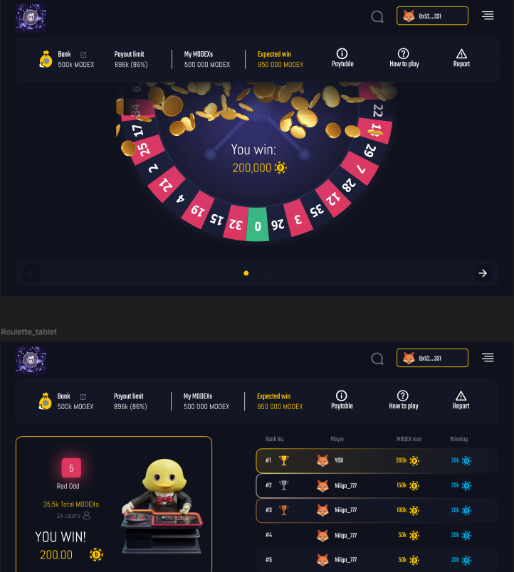
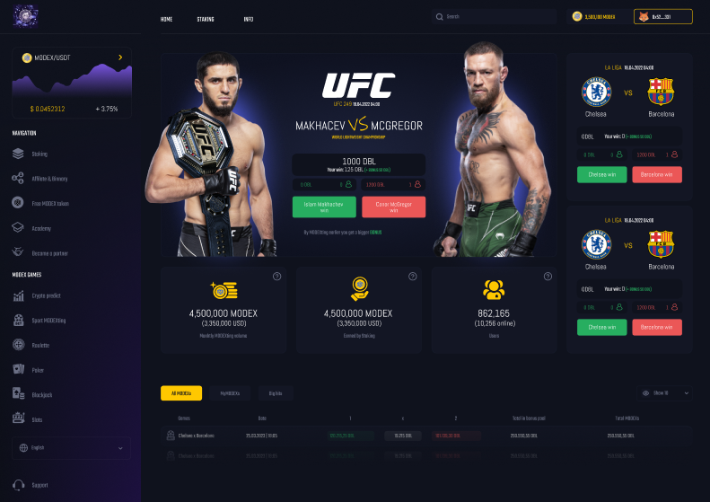
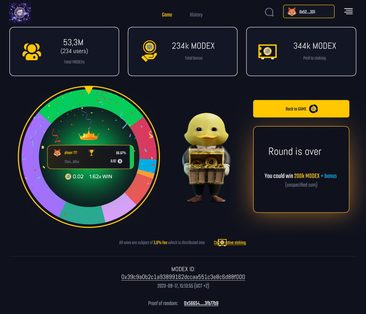

# Modex – Web3 Staking, Gaming & Betting Platform (Demo Version)

 

## Project Overview
**Modex** is a **multi-utility Web3 platform** that combines staking, casino-style gaming, sports betting, and education into a single blockchain-powered ecosystem.

### Core Features
- **Staking:** Lock MODEX tokens (and other supported assets) to earn rewards and sustain the gaming economy.
- **Gaming:** Play fast, provably fair games including roulette, slots, and prize wheels.
- **Sports Betting:** Wager on live and upcoming events with competitive odds and diverse market options.
- **Academy:** Access interactive learning modules covering blockchain basics, platform use, and risk management.

Our mission is to deliver an **all-in-one hub** where users can **play, earn, and learn** without needing multiple platforms.

---

## Demo Version
The demo highlights:
- **Staking Dashboard** – Simulated staking with reward tracking.
- **Mini Games Preview** – Early builds of roulette, slots, and spin-the-wheel.
- **Sports Betting UI** – Mock-up with odds feeds and betting slip preview.
- **Academy Hub** – Interactive tutorials and gamified quizzes.

> **Note:** This demo uses **testnet contracts** and mock data for demonstration. It is **not connected to mainnet or real funds**.

---

## Screenshots & UI Preview

### Staking Dashboard
  
*Lock MODEX tokens and monitor rewards in real-time.*

### Game Lobby
  
*Casino-style game previews including roulette, slots, and prize wheel.*

### Sports Betting UI
  
*Preview of live and upcoming betting markets.*

### Academy Module
  
*Gamified learning hub with blockchain fundamentals.*

---

## Installation & Running the Project

### 1. Clone the Repository
```bash
git clone https://github.com/ModexTech/Modex-Platform-MVP
cd Modex-Platform-MVP
```

### 2. Install Dependencies
```bash
npm install
```

### 3. Run the Development Server
```bash
npm start
```

### The application will start on:
```bash
http://localhost:3000
```

## Tech Stack
- **Frontend** – React / Next.js / TailwindCSS
- **Blockchain** – Solidity / Hardhat / Ethers.js
- **Backend** – Node.js / TypeScript / PostgreSQL / Redis
- **Games** – Phaser.js / Unity / WebGL
- **Sports Data** – Integrated via 3rd-party APIs
- **Enterprise Layer** – Modex BCDB middleware

## Company Info
**Modex – Building blockchain-powered gaming, staking & education.**

- **Website**: [https://www.modex.tech](https://www.modex.tech)  
- **Docs / Project Brief**: [https://www.scribd.com/document/918651030/Modex-Platform](https://www.scribd.com/document/918651030/Modex-Platform)  
- **Contact**: hello@modex.tech  
- **Company**: Modex Tech Limited, 57/63 Line Wall Road, Gibraltar, GX11 1AA  
