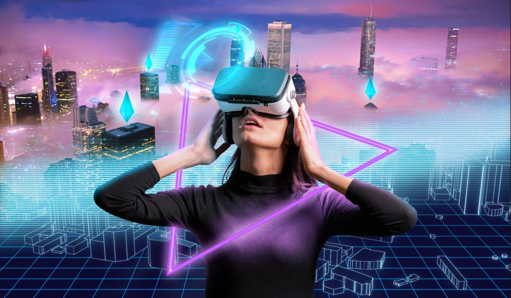

# SpaceXView Metaverse — MVP
 

SpaceXView Metaverse is a next-generation **space-technology powered virtual world**, combining  
**real satellite data**, **blockchain ownership**, **AI simulation**, and **Web-native 3D environments**  
to create an evolving digital universe.

This MVP demonstrates the core foundation of our upcoming **Space + Web3 + Metaverse platform**.

---

## 🌌 Vision

After half a century of human activity in outer space, we are now extending  
our area of exploration into **virtual space**.

SpaceXView Metaverse aims to:

- Unlock **new economic and technological opportunities** in the multiverse era  
- Enable real-time **satellite-based environments** inside a 3D virtual world  
- Allow users to **own, trade, and utilize virtual space assets**  
- Bridge **space data, AI simulation, and blockchain** into one unified environment  

> **Our mission:** Build an infinite, scalable virtual universe powered by real space intelligence.

---

## 🛠 Tech Stack

### **Frontend / Client**
- React / Next.js  
- WebGL  
- Three.js / Babylon.js / WebGPU  
- Unity / Unreal (optional extensions)  

### **Backend**
- Node.js / TypeScript  
- GraphQL / REST  
- Real-time sync with WebSockets  

### **Blockchain**
- Solidity  
- EVM-compatible network  
- NFT ownership (virtual land, satellites, environments)  
- Wallet integrations (MetaMask, WalletConnect)  

### **AI + Space Data**
- AI-assisted world generation  
- 3D asset generation  
- Satellite data ingestion (remote sensing, geospatial)  
- Physics / orbit simulation  

### **Cloud & Infrastructure**
- AWS / GCP  
- Cloud storage for assets  
- CD/CI automation  

---

## 🌍 MVP Features

✔ Web-based 3D metaverse environment  
✔ Scalable world rendering  
✔ Wallet login  
✔ Virtual land prototype  
✔ Basic satellite visualization  
✔ User avatar system  
✔ Blockchain asset registry  
✔ AI-powered terrain generation (prototype)  

---

# System Architecture Overview

This document provides a high-level overview of the system architecture for the Web / Metaverse platform.

## Architecture Diagram

```plaintext
               +------------------------+
               |   Web / Metaverse UI   |
               | (React, WebGL, Unity)  |
               +-----------+------------+
                           |
                           v
  +--------------------------------------------------+
  |        Backend / API Layer (Node.js)             |
  |  Auth • Sync • Land Registry • Satellite Data   |
  +-----------------------+--------------------------+
                          |
            +-------------+--------------+
            |                            |
            v                            v
 +-------------------+        +-------------------------+
 |  Blockchain Layer |        |   Space Data Engine     |
 |  NFT • Wallet •   |        |  Orbits • GeoLayers     |
 |  Asset Ownership  |        |  AI Terrain Models      |
 +-------------------+        +-------------------------+
```

## 🗺 Roadmap (2025)

### **Q1**
- MVP deployment  
- Web-based metaverse login  
- Basic virtual land system  

### **Q2**
- Blockchain asset integration  
- AI world-generation v1  
- Satellite data pipeline  

### **Q3**
- Avatar + multiplayer mode  
- SpaceTech simulation  
- Marketplace demo  

### **Q4**
- Full metaverse release  
- Enterprise + research integrations  
- Partnerships (Space, AI, Web3)

---

## Installation & Running the Project

### 1. Clone the Repository & Install Dependencies
```bash
npm install
```

### 2. Run the Development Server
```bash
npm start
```

### The application will start on:
```bash
http://localhost:3000
```
## 👥 Team & Hiring

We are building a **global, multi-national team across Europe and the United States**  
to scale the SpaceXView Metaverse ecosystem.

### 🚀 Open Positions
- **C-Level Leadership**
  - CEO  
  - CTO  
  - CPO  
  - COO  

- **Engineering & Product**
  - Blockchain Engineers  
  - Metaverse Developers (Unity / Unreal Engine)  
  - Web3 Frontend Engineers  
  - AI & Simulation Engineers  
  - Space-Data & Geospatial Engineers  

---

## 🤝 Contributions

We welcome contributions from global innovators.

### You can contribute as:
- Web3 Developers  
- AI Researchers  
- Space Engineers / Satellite Data Engineers  
- Metaverse Creators & 3D Artists  

Feel free to open:
- Pull Requests  
- Issues  
- Feature Proposals  

Let’s build together.

---

## 🌠 Join the Space Metaverse Revolution

**SpaceXView** is unlocking a new frontier where  
**Space × Blockchain × Metaverse × AI** merge into a next-generation digital universe.

We invite developers, researchers, creators, and innovators to help build  
the **Metaverse of Space** — a new world of virtual exploration powered by  
real satellite data, blockchain ownership, and AI-driven worlds.

**🌌 Let’s build the next digital universe together.**
